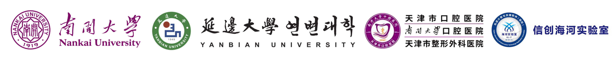

# LM-PCVMNet
LM-PCVMNet: Pediatric Cervical Vertebral Maturation Analysis with Deep Fusion of Landmarks and Metadata


<div align="center">
  
</div>


## Updates
- [2026-08-20] PCVM+ Dataset released!
- [2026-08-09] The extended version of the conference paper is accepted by Information Fusion!
- [2025-10-06] Our paper is accepted by BIBM 2025!

## Dataset


★ Our dataset is available for reserach purpose only. To apply for PCVM+ dataset, please fill out [the form](https://github.com/ybupengwang/LM-PCVMNet/blob/main/application.pdf)  and 
send the signed e-copy to Peng Wang (email: pwang@ybu.edu.cn) and Pro. Tao Li 
(email: litao@nankai.edu.cn) . We will send you the dataset link and password when recieving the data registration form.

★ The iCVM-900 dataset used in this study was originally introduced in the paper:

> **iCVM: An Interpretable Deep Learning Model for CVM Assessment Under Label Uncertainty**

The original iCVM-900 dataset is not publicly released and can be accessed by contacting the original authors according to their data sharing policy.
In this work, we further extended the iCVM-900 dataset by annotating **13 anatomical landmarks** on the cervical vertebrae images to support our research. We only provide the [newly added landmark annotations](https://github.com/ybupengwang/LM-PCVMNet/blob/main/icvmlabel.zip), while the original images are not redistributed.
Researchers interested in accessing the original iCVM-900 dataset should contact the authors of the original paper.
We sincerely thank the authors of **iCVM** for sharing their dataset and making this research possible.


## Citation

If you find this code or dataset useful, please cite our paper:
```c
@article{Wang2026LMPCVMNetPC,
  title={LM-PCVMNet: Pediatric Cervical Vertebral Maturation Analysis with Deep Fusion of Landmarks and Metadata},
  author={Peng Wang and Wanzhen Song and Anli Wang and Xueshuo Xie and Xiaohang Guan and Tao Li},
  journal={Information Fusion},
  year={2026}
}
```
```c
@article{Wang2025PCVMNetLT,
  title={PCVMNet: Landmark-Aware Transformer Network for Pediatric Cervical Vertebral Maturation Assessment},
  author={Peng Wang and Xiaohang Guan and Anli Wang and Zhenguo Zhang and Xueshuo Xie and Tao Li},
  journal={2025 IEEE International Conference on Bioinformatics and Biomedicine (BIBM)},
  year={2025},
  pages={2879-2885}
}
```


